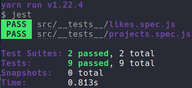

	

	<h1>Node.js Concepts</h1>

### Summary

- [About the challenge](#about-the-challenge)

- [Routes](#Routes)

- [Tests](#Tests)

- [Back to all challenges](https://github.com/felipejsborges/gostack_bootcamp_challenges#gostack-bootcamp-challenges-)

### About the challenge

- An application to storage repositories of a portfolio, that will allow you to list, update, and delete repositories, and besides that, the repositories can also receive likes.

### Routes

- **`POST /repositories`**: The route must receive `title`, `URL`, and `techs` inside of the request body. The URL must be the link to the Github of that repository.

- **`GET /repositories`**: The route that lists all repositories.

- **`PUT /repositories/:id`**: The route should only change the `title`, `URL` and `techs` of the repository that has the` id` equal to the `id` present in the route parameters.

- **`DELETE /repositories/:id`**: The route must delete a repository with the `id` present in the route parameters.

- **`POST /repositories/:id/like`**: The route must increase the number of likes from the specific repository chosen through the `id` param present in the route parameters, at each call of this route, the number of likes must be increased by 1.

### Tests

- **`should be able to create a new repository`**

- **`should be able to list the repositories`**

- **`should be able to update repository`**

- **`should not be able to update a repository that does not exist`**

- **`should not be able to update repository likes manually`**

- **`should be able to delete the repository`**

- **`should not be able to delete a repository that does not exist`**

- **`should be able to give a like to the repository`**

- **`should not be able to like a repository that does not exist`**

	
	

by Felipe Borges 
[LinkedIn](https://www.linkedin.com/in/felipejsborges) | [GitHub](https://github.com/felipejsborges)
