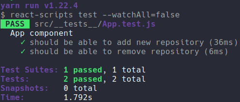

	

	<h1>ReactJS Concepts</h1>

### Summary

- [About the challenge](#about-the-challenge)

- [Features](#Features)

- [Tests](#Tests)

- [Back to all challenges](https://github.com/felipejsborges/gostack_bootcamp_challenges#gostack-bootcamp-challenges-)

### About the challenge

- The front-end part of [2nd challenge](https://github.com/felipejsborges/gostack_bootcamp_challenges/tree/master/02_nodejs_concepts) using ReactJS.

### Features

- List repositories of our API

- Add a repository in our API

- Delete a repository of our API

### Tests

- **`should be able to add new repository`**

- **`should be able to remove repository`**

	
	

by Felipe Borges 
[LinkedIn](https://www.linkedin.com/in/felipejsborges) | [GitHub](https://github.com/felipejsborges)
