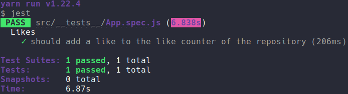

	

	<h1>React Native Concepts</h1>

### Summary

- [About the challenge](#about-the-challenge)

- [Features](#Features)

- [Tests](#Tests)

- [Back to all challenges](https://github.com/felipejsborges/gostack_bootcamp_challenges)

### About the challenge

- The mobile part of [2nd](https://github.com/felipejsborges/gostack_bootcamp_challenges/tree/master/02_nodejs_concepts) and [3rd](https://github.com/felipejsborges/gostack_bootcamp_challenges/tree/master/03_reactjs_concepts) challenges using React Native.

### Features

- List repositories of our API

- Like a listed repository

### Tests

- **`should add a like to the like counter of the repository`**: In order for this test to pass, your application must allow click on the Like button, a like be added to the listed repository and this update must be displayed on the screen.

	
	

by Felipe Borges 
[LinkedIn](https://www.linkedin.com/in/felipejsborges) | [GitHub](https://github.com/felipejsborges)
