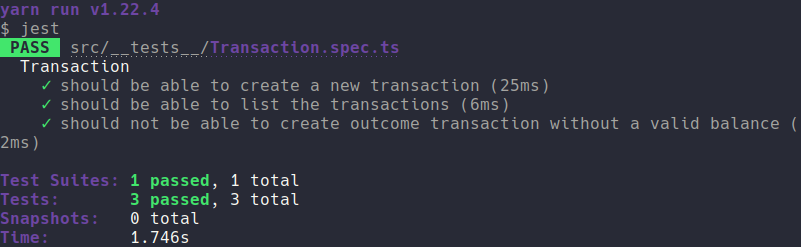

	

	<h1>Node.js Fundamentals</h1>

### Summary

- [About the challenge](#about-the-challenge)

- [Routes](#Routes)

- [Tests](#Tests)

- [Back to all challenges](https://github.com/felipejsborges/gostack_bootcamp_challenges)

### About the challenge

- An application to add, store and list income and outcome financial transactions.

### Routes

- **`POST /transactions`**: The route must receive title, value and type (income or outcome) on request body.

- **`GET /transactions`**: The route must return a list with all stored transactions and the income, outcome and total balance.

### Tests

- **`should be able to create a new transaction`**

- **`should be able to list the transactions`**

- **`should not be able to create an outcome transaction without a valid balance`**

	
	

by Felipe Borges 
[LinkedIn](https://www.linkedin.com/in/felipejsborges) | [GitHub](https://github.com/felipejsborges)
