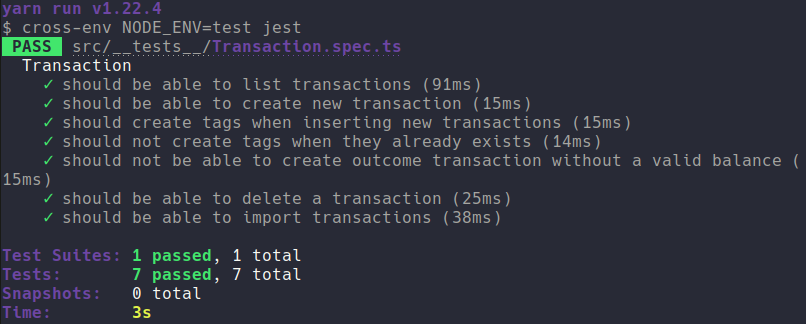

	

	<h1>Database and files upload</h1>

### Summary

- [About the challenge](#about-the-challenge)

- [Routes](#Routes)

- [Tests](#Tests)

- [Back to all challenges](https://github.com/felipejsborges/gostack_bootcamp_challenges)

### About the challenge

- An application to store income and outcome financial transactions, add new ones, and list all of them. Allow to create transactions from a .csv file.

### Routes

- **`POST /transactions`**: The route must receives title, value and type (income or outcome) on request body. The transaction must be stored inside our database.

- **`GET /transactions`**: The route must return a list with all stored transactions and the income, outcome and total balance.

- **`DELETE /transactions/:id`**: The route must delete a transaction with the id in the params.

**`POST /transactions/import`**: The route must allow to import a .csv file with the same information that need to create a new transaction. Each line of this file must be a new register to de database.

### Tests

- **`should be able to create a new transaction`**: In order for this test to pass, your application must allow a transaction to be created, and return a JSON with it.

- **`should be able to list the transactions`**: In order for this test to pass, your application must return an array with all the transactions that have been created, the income, outcome and total balance.

- **`should not be able to create an outcome transaction without a valid balance`**: In order for this test to pass, your application must not allow a outcome transaction with value bigger than user balance, returning a error with status 400.

- **`should create tags when inserting new transactions`**: In order for this test to pass, your application must allow create a new category if we try to create a transaction with a non-existent category.

- **`should not create tags when they already exists`**: In order for this test to pass, your application must not allow to create duplicated categories.

- **`should be able to delete a transaction`**: In order for this test to pass, your application must allow to delete a transaction and returns an empty response with status 204.

- **`should be able to import transactions`**: In order for this test to pass, your application must allow to create transactions from a .csv file and returns a json with all imported transaction.

	
	

by Felipe Borges 
[LinkedIn](https://www.linkedin.com/in/felipejsborges) | [GitHub](https://github.com/felipejsborges)
