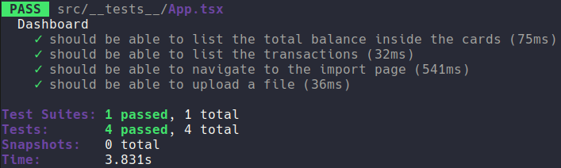

	

	<h1>ReactJS Fundamentals</h1>

### Summary

- [About the challenge](#about-the-challenge)

- [Features](#Features)

- [Tests](#Tests)

- [Back to all challenges](https://github.com/felipejsborges/gostack_bootcamp_challenges)

### About the challenge

- The front-end part of [6th challenge](https://github.com/felipejsborges/gostack_bootcamp_challenges/tree/master/06_db_and_files_upload) using ReactJS.

### Features

- List transactions of our API

- Show balance

- Import csv files

### Tests

- **`should be able to list the total balance inside the cards`**: In order for this test to pass, your application must allow to show card with income, outcome and total balance.

- **`should be able to list the transactions`**: In order for this test to pass, your application must allow to list all the transactions inside a table.

- **`should be able to navigate to the import page`**: In order for this test to pass, your application must allow to change pages by clicking on Header and Import button.

- **`should be able to upload a file`**:In order for this test to pass, your application must allow to send a .csv file by drag-n-drop on `import` on import page.

	
	

by Felipe Borges 
[LinkedIn](https://www.linkedin.com/in/felipejsborges) | [GitHub](https://github.com/felipejsborges)
