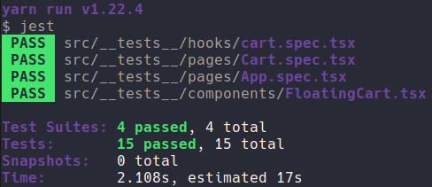

	

	<h1>React Native Fundamentals</h1>

### Summary

- [About the challenge](#about-the-challenge)

- [Features](#Features)

- [Tests](#Tests)

- [Back to all challenges](https://github.com/felipejsborges/gostack_bootcamp_challenges)

### About the challenge

- The mobile part of [6th](https://github.com/felipejsborges/gostack_bootcamp_challenges/tree/master/06_db_and_files_upload) and [7th](https://github.com/felipejsborges/gostack_bootcamp_challenges/tree/master/07_reactjs_fundamentals) challenges using React Native and async storage.

### Features

- List products from fake API

- Add items to cart

- Show cart items

- Increase cart items quantity

- Decrease cart items quantity

- Show total value of cart items

### Tests

- **`should be able to list the products`**

- **`should be able to add a product to the cart`**

- **`should be able to list the products on the cart`**

- **`should be able to calculate the cart total`**

- **`should be able to show the total quantity of itens in the cart`**

- **`should be able to increment product quantity on the cart`**

- **`should be able to decrement product quantity on the cart`**

- **`should be able to navigate to the cart`**

- **`should be able to add products to the cart`**

- **`should be able to increment quantity`**

- **`should be able to decrement quantity`**

- **`should store products in AsyncStorage while adding, incrementing and decrementing`**

- **`should load products from AsyncStorage`**

	
	

by Felipe Borges 
[LinkedIn](https://www.linkedin.com/in/felipejsborges) | [GitHub](https://github.com/felipejsborges)
