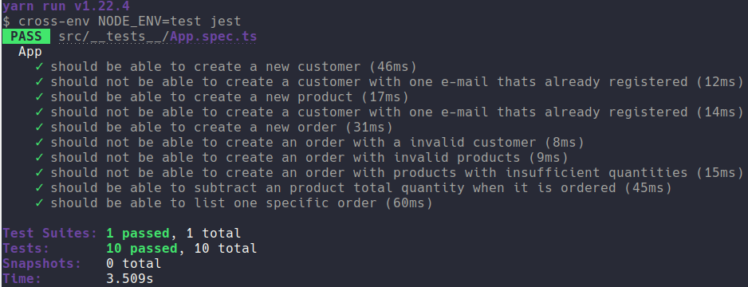

	

	<h1>Database Relationships</h1>

### Summary

- [About the challenge](#about-the-challenge)

- [Routes](#Routes)

- [Tests](#Tests)

- [Back to all challenges](https://github.com/felipejsborges/gostack_bootcamp_challenges#gostack-bootcamp-challenges-)

### About the challenge

- An application to create customers, products and orders. It's a back-end of an e-commerce.

### Routes

- **`POST /customers`**: The route must receive `name` and `email` in request.body and register this customer on database.

- **`POST /products`**: The route must receive `name`, `price` and `quantity in request.body and register this product on database.

- **`POST /orders/`**: The route must receive `customer_id` and an array products with `id` and `quantity`. Register on `order` table a new order that is relationed with the customer. And on `orders_products`table, register `product_id`, `order_id`, `price` and `quantity`.

- **`GET /orders/:id`**: The route must return the information of a specific order with all relationed data of tables orders`, `customers` and `orders_products`

### Tests
To run tests in this challenge, you must create a database called "gostack_desafio09_tests".

- **`should be able to create a new customer`**

- **`should not be able to create a customer with one e-mail thats already registered`**

- **`should be able to create a new product`**

- **`should not be able to create a duplicated product`**

- **`should be able to create a new order`**

- **`should not be able to create an order with a invalid customer`**

- **`should not be able to create an order with invalid products`**

- **`should not be able to create an order with products with insufficient quantities`**

- **`should be able to subtract an product total quantity when it is ordered`**

- **`should be able to list one specific order`**

	
	

by Felipe Borges 
[LinkedIn](https://www.linkedin.com/in/felipejsborges) | [GitHub](https://github.com/felipejsborges)
