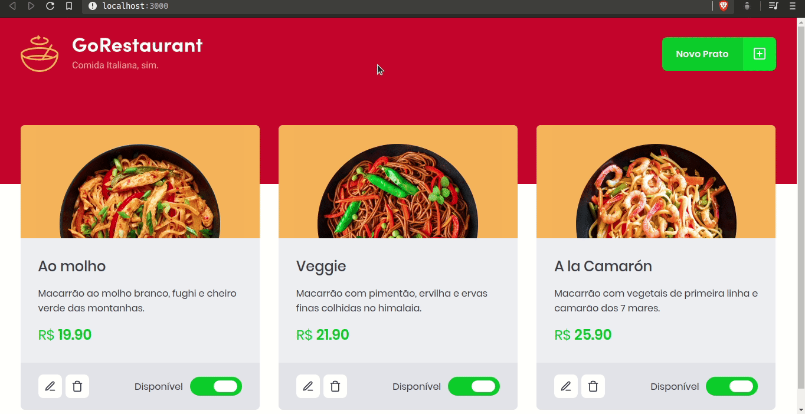
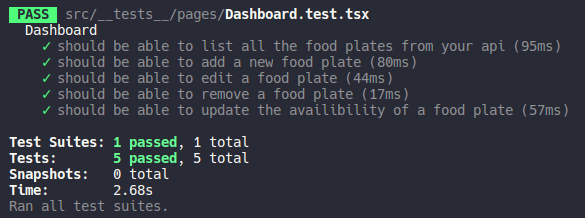

	

	<h1>ReactJS CRUD</h1>

### Summary

- [About the challenge](#about-the-challenge)

- [Features](#Features)

- [Tests](#Tests)

- [Back to all challenges](https://github.com/felipejsborges/gostack_bootcamp_challenges#gostack-bootcamp-challenges-)

### About the challenge

- In order to practice CRUD concepts - Create, Read, Update and Delete -, in this challenge, I developed a website GoRestaurant. This application connect with a fake API to show created food plates and allow to create, remove and update this plates.

### Features

- List plates of our API

- Add new plates

- Edit created plates

- Delete plates

- Change plate availability

	

### Tests

- **`should be able to list all the food plates from your api`**

- **`should be able to add a new food plate`**

- **`should be able to edit a food plate`**

- **`should be able to remove a food plate`**

- **`should be able to update the availibility of a food plate`**
 

	
	

by Felipe Borges 
[LinkedIn](https://www.linkedin.com/in/felipejsborges) | [GitHub](https://github.com/felipejsborges)
